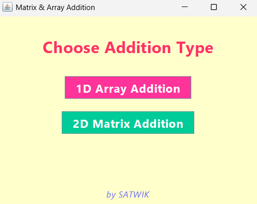
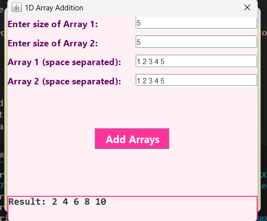
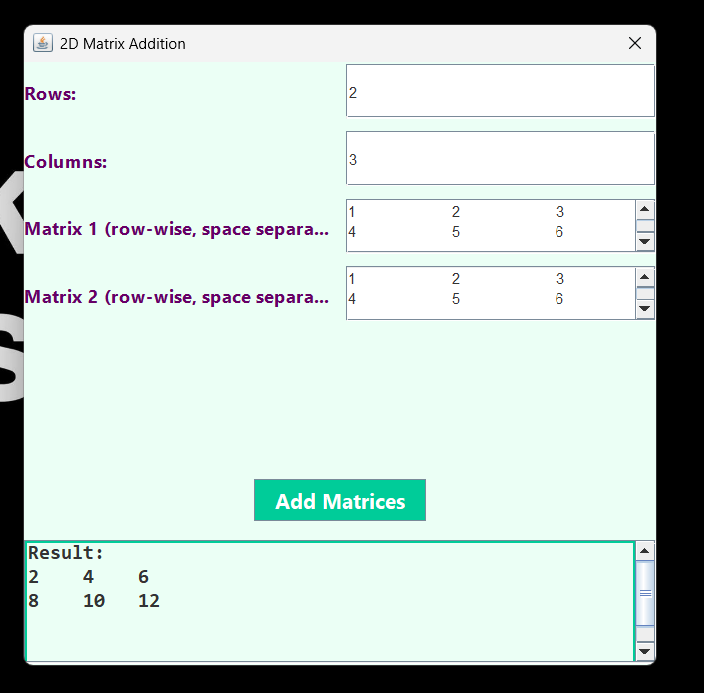

# Matrix Addition App 🧮

## 📌 Description

**Matrix Addition App** is a simple Java console application that performs addition of two matrices. The user is prompted to enter the dimensions and elements of two matrices, and the application computes and displays the resulting matrix.

This project is ideal for beginners learning:
- Java basics
- 2D arrays
- Loops and user input
- Input validation (optional improvement)

---

## 📸 Screenshots

### 🖼️ Program Start


### 🖼️ Array Input and Output


### 🖼️ Matrix Input and Output



## 🛠️ Features

- Input custom matrix sizes and elements
- Automatically checks if addition is possible (same dimensions)
- Prints the result matrix in a formatted layout

---

## 📂 Project Structure

```
MatrixAdditionApp/
│
├── MatrixAddition.java      # Main source code
├── README.md                # Project documentation
└── 1stpage.png              # (Optional) Sample output screenshot
└── 1darray.png
└── 2darray.png
```

---

## 🚀 How to Run

### 🧰 Prerequisites
Make sure you have the following installed:
- Java Development Kit (JDK 8+)
- A terminal or command prompt
- A text editor (e.g., VS Code, IntelliJ, Notepad++)

---

### ▶️ Steps to Compile and Run

1. **Navigate to your project folder**
   ```bash
   cd path/to/your/project/folder
   ```

2. **Compile the Java file**
   ```bash
   javac MatrixAddition.java
   ```

3. **Run the compiled class**
   ```bash
   java MatrixAddition
   ```

---

## 📦 Sample Input / Output

### ✅ Input

```
Enter number of rows of matrix 1: 2
Enter number of columns of matrix 1: 2
Enter elements of matrix 1:
1 2
3 4

Enter number of rows of matrix 2: 2
Enter number of columns of matrix 2: 2
Enter elements of matrix 2:
5 6
7 8
```

### ✅ Output

```
----------------------Addition of 2D matrix is----------------------
6 8
10 12
```

---

## 🧑‍💻 Author

- Developed by **[Satwik Saxena]**
- GitHub: [https://github.com/satwik12-dev](https://github.com/satwik12-dev)

---

## 📝 License

This project is open-source and available under the MIT License.

---

## 🔧 To-Do / Improvements

- Add matrix subtraction and multiplication
- GUI using Swing or JavaFX
- Input validation and error handling
