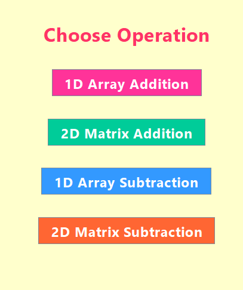
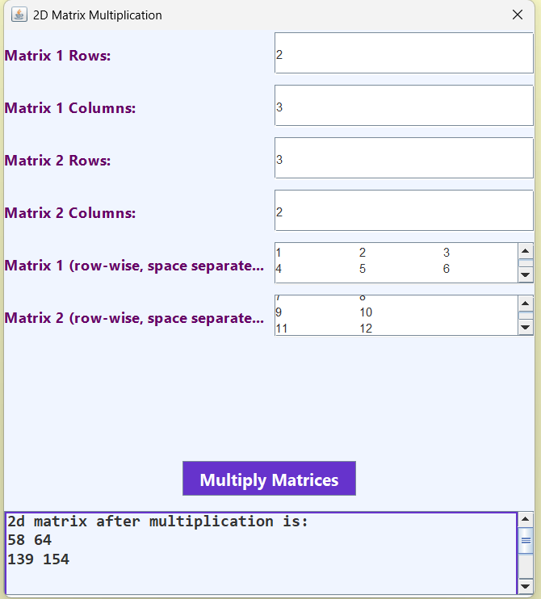

# Matrix Arithmetic Operations Console and GUI Based APP 🧮

## 📌 Description

**Matrix Addition App** is a simple Java console as well as GUI based application that performs arithmetic operations on two matrices i.e Addition, Subtraction, Multiplication. The user is prompted to enter the dimensions and elements of two matrices, and the application computes and displays the resulting matrix.

This project is ideal for beginners learning:
- Java & Swing 
- 1D & 2D arrays
- Loops and user input
- Input validation

---

## 📸 Screenshots

### 🖼️ Program Start


### 🖼️ Array Addition Input and Output


### 🖼️ Matrix Addition Input and Output


### 🖼️ Array Subtraction Input and Output


### 🖼️ Matrix Subtraction Input and Output


### 🖼️ Array Multiplication Input and Output


### 🖼️ Matrix Multiplication Input and Output



## 🖥️ Sample Input/Output (Console-based)

### ▶️ Sample Session

```
Choose the operations You want to perform from the given list:
1: 1-Dimension Array Addition
2: 2-Dimension Array Addition
3: 1-Dimension Array Subtraction
4: 2-Dimension Array Subtraction
5: 1-Dimension Array Multiplication
6: 2-Dimension Array Multiplication
0: Exit.....
Enter the operation you want to perform from their S.NO. i.e 1,2,3,4,5,6,0:
1
Enter the size of array 1:
3
Enter the size of array 2:
3
Enter the element of array 1:
1 2 3
Enter the element of array 2:
4 5 6
Your both 1D Array after addition is:
5 7 9 
Addition Completed for 1D Array.......

Enter the operation you want to perform from their S.NO. i.e 1,2,3,4,5,6,0:
2
Enter the row and column of Matrix 1:
2 2
Enter the row and column of Matrix 2:
2 2
Enter the element of matrix 1:
1 2
3 4
Enter the element of matrix 1:
5 6
7 8
Your 2D Matrix after addition is:
6 8 
10 12 
Addition Completed for 2D Array.......

Enter the operation you want to perform from their S.NO. i.e 1,2,3,4,5,6,0:
0
Exiting the program.....
```

## 🛠️ Features

- Input custom matrix sizes and elements
- Automatically checks if addition is possible (same dimensions)
- Prints the result matrix in a formatted layout

---

## 📂 Project Structure

```
Arrays/
├── MatrixOperationsConsoleBased.java
├── MatrixAdditionGUIBASED.java
└── README.md
```

---

## 🚀 How to Run

### 🧰 Prerequisites
Make sure you have the following installed:
- Java Development Kit (JDK 8+)
- A terminal or command prompt
- A text editor (e.g., VS Code, IntelliJ, Notepad++)

---

### ▶️ Steps to Compile and Run

1. **Navigate to your project folder**
   ```bash
   cd path/to/your/project/folder
   ```

2. **Compile the Java file**
   ```bash
   javac MatrixAddition.java
   ```

3. **Run the compiled class**
   ```bash
   java MatrixAddition
   ```

---

## 🧑‍💻 Author

- Developed by **Satwik Saxena**
- GitHub: [https://github.com/satwik12-dev](https://github.com/satwik12-dev)

---

## 📝 License

This project is open-source and available under the MIT License.

---

